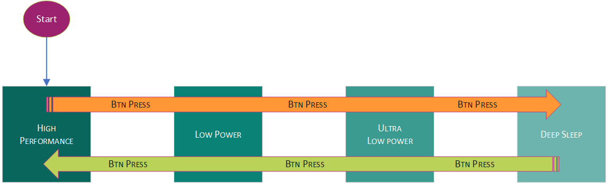

[Click here](../README.md) to view the README.

## Design and implementation

The design of this application is minimalistic to get started with the secure request framework (SRF) on PSOC&trade; Edge MCUs. All PSOC&trade; Edge E84 MCU applications have a dual-CPU three-project structure to develop code for the CM33 and CM55 cores. The CM33 core has two separate projects for the secure processing environment (SPE) and non-secure processing environment (NSPE). A project folder consists of various subfolders, each denoting a specific aspect of the project. The three project folders are as follows:

**Table 1. Application projects**

Project | Description
--------|------------------------
*proj_cm33_s* | Project for CM33 secure processing environment (SPE)
*proj_cm33_ns* | Project for CM33 non-secure processing environment (NSPE)
*proj_cm55* | CM55 project

 

In this code example, at device reset, the boot process starts from the ROM boot with the secure enclave (SE). From the secure enclave, the boot flow is passed on to the CPU subsystem where the secure CM33 application starts.

Secure CM33 application configures the clocks, pins, clock to peripheral connections, and other platform resources. It applies the peripheral protection configurations as per the device configurations which makes the power and clock related resourses secure. **Table 2** below shows the register level peripheral protection controllers security configuration applied by this code example (w.r.t the "Hello World" CE). See the **System** tab of the Device Configurator for more information.

**Table 2. Register-level PPC secure configuration**

Register group                 | Address range
-------------------------------|------------------------
PERI_PCLK0_MAIN                | 0x42040000 - 0x4205FFFF
RRAMC0_RRAM_SRF_RRAMC_SRF_USER | 0x42213000 - 0x4221303F
M33SYSCPUSS                    | 0x42220000 - 0x4222FFFF
SRSS_GENERAL                   | 0x42400000 - 0x424003FF
SRSS_HIB_DATA                  | 0x424008A0 - 0x424008AF
SRSS_MAIN                      | 0x42401000 - 0x42401FFF
SRSS_SECURE                    | 0x42402000 - 0x42403FFF
RAM_TRIM_SRSS_SRAM             | 0x42404000 - 0x4240403F
PWRMODE_PWRMODE                | 0x42410000 - 0x42417FFF
M55APPCPUSS                    | 0x44100000 - 0x4410FFFF
SOCMEM_PPU_SOCMEM_PPU          | 0x44660000 - 0x44660FFF

Secure application then performs SRF initialization and registers the custom/user SRF module which implements the custom secure aware power management APIs in this CE and configures the System Deep Sleep mode. After this, the flow is passed on to the non-secure CM33 application.

Resource initialization for this example is performed by this CM33 non-secure application. The retarget-io middleware is configured to use the debug UART to prints necessary messages on the terminal emulator, the onboard KitProg3 acts the USB-UART bridge to create the virtual COM port. The user LED 1 blinks every 500 millisecond. GPIO interrupt is configured to detect **USER BTN1** press and the required state machine to switch the power mode. It then enables the CM55 core using the `Cy_SysEnableCM55()` function and the CM55 core is subsequently put into Deep Sleep mode.

**Table 3** displays the configurations for different power modes supported in this code example. It includes the API functions used, VCCD voltage, and CM33 and CM55 clock speeds.

**Table 3. Power mode configuration**

Power mode | API used | SRF Module (type) | VCCD  | CM33 clock | CM55 clock
:--------- | :------- | :------------     | :---- | :--------- | :---------
High performace (HP)  | `Cy_USER_SysEnterHp`          | USER SYSPM (custom)   | 0.9 V    | 200 MHz           | 400 MHz   
Low power (LP)        | `Cy_USER_SysEnterLp`          | USER SYSPM (custom)   | 0.8 V    | 70 MHz            | 140 MHz   
Ultra low power (ULP) | `Cy_USER_SysEnterUlp`         | USER SYSPM (custom)   | 0.7 V    | 50 MHz            | 50 MHz    
Deep Sleep (DS)       | `Cy_SysPm_CpuEnterDeepSleep`  | PDL SYSPM (built-in) | 0.7 V    | Off               | Off      

> **Note:** Reference clock variable (*SystemCoreClock*) is not updated to reflect the change in CM33 core clock frequency after switching the power modes. This is intentional in this code example, to demonstrate the effect of power mode transitions through change in User LED 1 blink frequency. It can be updated using `SystemCoreClockUpdate` API.

To control the power mode, press the **USER BTN1**. Each press of the button causes the firmware to change its power mode based on the following flowchart:

   **Figure 1. Flow diagram for switching power modes**

   

### Custom SRF module

The Peripheral Driver Library (PDL) provides many secure aware APIs, such as `Cy_SysPm_CpuEnterDeepSleep`, through SRF. You are free to implement additional secure aware APIs using the SRF based on your requirement. This CE implements a custom SRF module called *MTB_SRF_MODULE_USER*, containing a sub-module called *CY_USER_SECURE_SUBMODULE_SYSPM*, which supports three operations listed in **Table 4**.

**Table 4. USER SYSPM module operations**

Operation                             | Invoked by API                     
:------------------------------------ | :--------------------
CY_USER_SYSPM_OP_ENTERHIGHPERFORMANCE | `Cy_USER_SysEnterHp`
CY_USER_SYSPM_OP_ENTERLOWPOWER        | `Cy_USER_SysEnterLp`    
CY_USER_SYSPM_OP_ENTERULTRALOWPOWER   | `Cy_USER_SysEnterUlp`

The SRF USER module is implemented by the files available in the *user_srf* folder at the root of the project. Each file contains the code required for both secure and non-secure environments. See **Table 5** to understand the code orgainization.

**Table 5. SRF USER module files**

File                                   | Description                    
:------------------------------------- | :--------------------
*usr_srf.c   user_srf.h*            | Defines the SRF USER module by listing the sub-module with its operations. Implements and exposes APIs required for registration of the module and initialization of memory pool used by the module when it invokes the SRF for its operations
*user_syspm_srf.c   user_syspm_srf.h* | Implements and lists the USER SYSPM submodule operations (Secure aware APIs)

 